# 文档：MCU学习经历 --时时更新
---
整理:  Keruone Klumsnow
学习设备: 野火STM32F103mini 
芯片型号: STM32F103RCT6

> 学习对象：[野火EmbedFire]《STM32库开发实战指南——基于野火MINI开发板》—20240202
> 参考：https://doc.embedfire.com/products/link/zh/latest/index.html
>> 本文的东西都只是复制黏贴罢了
> 
---
[toc]

---
## 一、单片机烧录方式
> 参考https://zhuanlan.zhihu.com/p/367821312
> 觉得作者(码农爱学习)讲的非常好，就 copy 下来了:smiley:
### 1. 烧录方式简单分类
* ISP (In-System Programming)
* ICP (In-circuit programmer)
* IAP (In-Application Programming)
### 2. 单片机Flash在地址映射表中位置
下图是一张STM32F4xx的地址映射表，从0x0000 0000到0xFFFF FFFF，总计4Gbyte。单片机的片上Flash、片上RAM、片上外设以及外部扩展接口的访问地址，都被映射到这4Gbyte的范围之内。
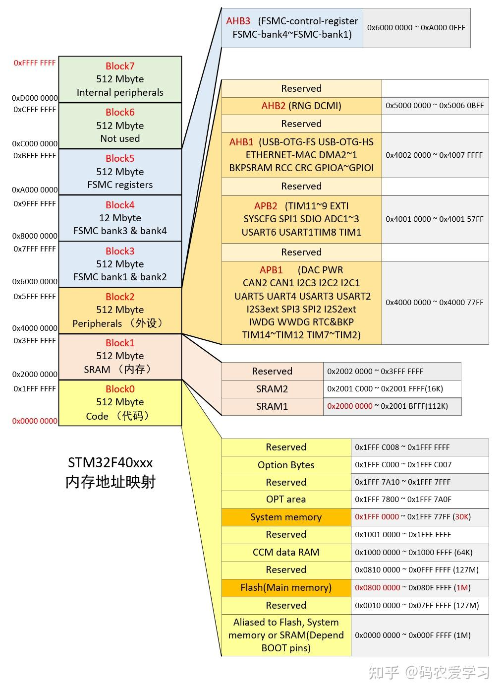
&emsp;这张图中，我们需要先注意下半部分
* **Main memory 主存储区**
通常，我们编写的代码，是放到主存储区的起始位置（0x0800 0000）开始运行的，烧录程序时，直接将程序烧录到这里即可（KEIL软件给STM32烧录程序的默认烧写地址就是0x0800 0000开始）
* **System memory 系统存储区**
System memory（起始位置0x1FFF 000）是STM32在出厂时，由ST在这个区域内部预置了一段BootLoader， 也就是我们常说的ISP程序 ，这是一块ROM，出厂后无法修改。

了解了程序的具体地址，还要看一下单片机的启动方式：
### 3. 启动方式选择
STM32有两个BOOT引脚，通过配置不同的高低电平，可以让单片机从不同的地址开始运行。
| boot0 | boot1 | 描述 |启动区域|对应烧录方式|
|:------:|:-----:|:-----|:------:|:--:|
|0|任意|通常我们是在Main memory **主存储区（0x0800 0000）运行程序**，BOOT0引脚拉低即可。 这种情况，KEIL软件给STM32烧录程序，就是**直接在这个地址烧录**，烧录完，**直接在这个地址处运行**。|主闪存存储器|ICP|
|1|0|这种情况就用在使用串口方式给STM32烧录程序，这时单片机从**系统存储器（0x1FFF 0000）启动**，运行的是**出厂预置的BootLoader程序**，可以**接收串口发来的程序**，并将其**写入Main memory（0x0800 0000**），程序烧录完成后，再将BOOT0引脚拉低，Main memory（0x0800 0000）处运行刚烧录的代码了。|系统存储器|ISP|
|1|1|这种情况是从内存中启动，**内置SRAM（也就是STM32的内存中）**，既然是SRAM，自然也就没有程序存储的能力了，这个模式一般用于程序调试。|内置SRAM|IAP|

### 4. 补充IAP
> 因为前两个较为好理解，就不多赘述了

IAP的原理与上面两种有较大区别，这种方式**将主存储区又分成了两个区域**（根据实际需要由开发者自行分配），<u>0800 0000起始处的这部分，存储一个开发者自己设计的Bootloader程序，另一部分存储真正需要运行的APP程序</u>。

单片机的Bootloader程序，其主要作用就是给单片机升级。在单片机启动时，首先从Bootloader程序启动，一般情况不需要升级，就会立即从Bootloader程序跳转到存储区另一部分的APP程序开始运行。

假如Bootloader程序时，需要进行升级（比如APP程序运行时，接收到升级指令，可以在flash中的特定位置设置一个标志，然后触发重启，重启后进入Bootloader程序，Bootloader程序根据标志位就能判断是否需要升级），则会通过某种方式（比如通过WIFI接收升级包，或借助另一块单片机接收升级包，Bootloader再通过串口或SPI等方式从另一块单片机获取升级包数据）先将接收到的程序写入存储区中存储APP程序的那个位置，写入完成后再跳转到该位置，即实现了程序的升级
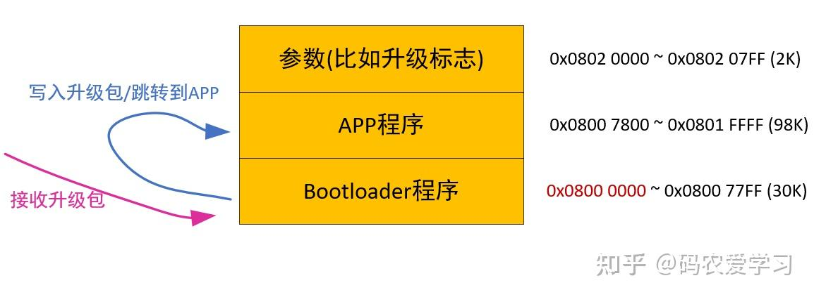

---
## 二、 了解STM32

STM32，从字面上来理解，ST 是意法半导体，M 是 Microelectronics 的缩写，32 表示 32 位，合起
来理解，STM32 就是指 ST 公司开发的 32 位微控制器。在如今的 32 位控制器当中，STM32 可以
说是最璀璨的新星，它受宠若娇，大受工程师和市场的青睐，无芯能出其右。

### 1. STM32F103RCT6 各字符含义
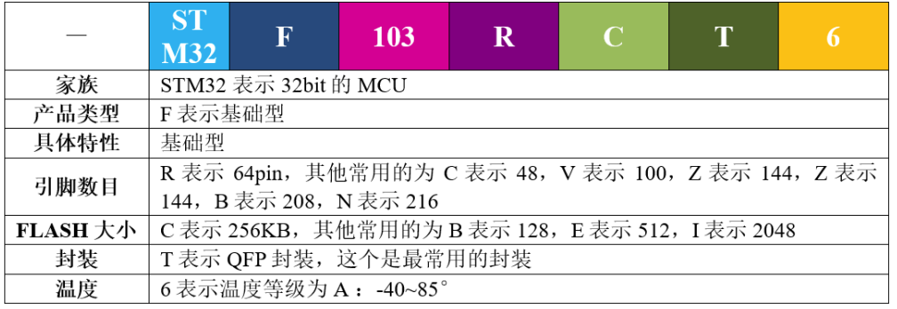
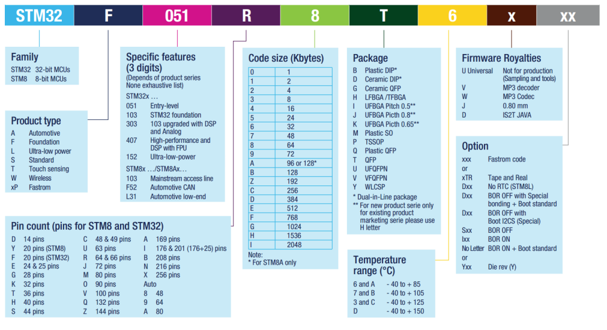
### 2. 如何分配原理图IO
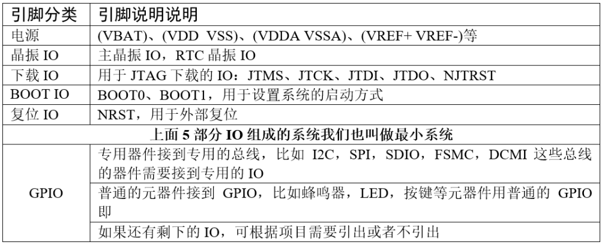
### 3. IO参考资料来源
要想根据功能来分配 IO，那就得先知道每个 IO 的功能说明，这个我们可以从官方的数据手册里面找到。在学习的时候，有两个官方资料我们会经常用到，一个是参考手册（英文叫 Referencemanual），另外一个是数据手册（英文叫 Data Sheet）。两者的具体区别见表格参考手册和数据手册的内容区别。
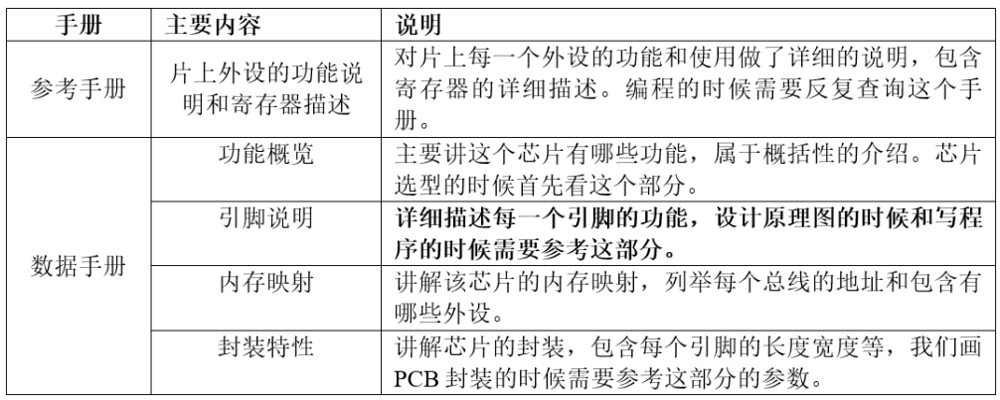
一句话概括：**数据手册**主要用于**芯片选型和设计原理图**时参考，**参考手册**主要用于在**编程**的时候查阅。官方的这两个文档可以从官方网址里面下载：https://www.stmcu.com.cn/Product/pro_detail/STM32F1/product.

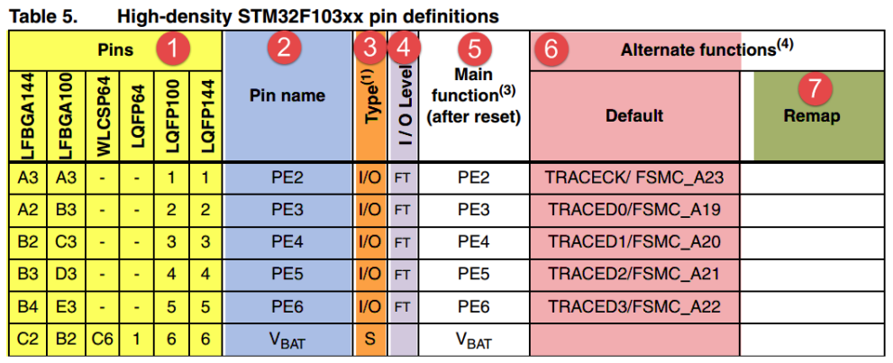
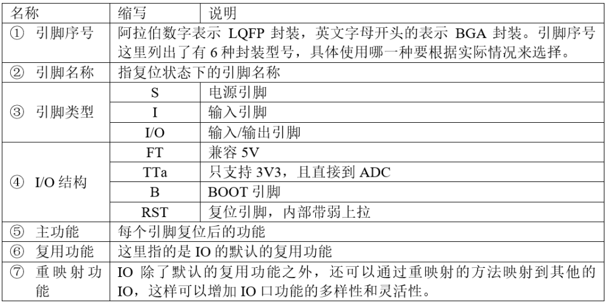

---
## 三、 寄存器学习
### 1. 芯片简析
我们看到的 STM32 芯片是已经封装好的成品，主要由内核和片上外设组成。若与电脑类比，内核与外设就如同电脑上的 CPU 与主板、内存、显卡、硬盘的关系。
STM32F103 采用的是 Cortex-M3 内核，内核即 CPU，由 ARM 公司设计。ARM 公司并不生产芯片，而是出售其芯片技术授权。芯片生产厂商 (SOC) 如 ST、TI、 Freescale，负责在内核之外设计部件并生产整个芯片，这些内核之外的部件被称为核外外设或片上外设。如 GPIO、USART（串口）、I2C、SPI 等都叫做片上外设。具体见图 *STM32 芯片架构简图*。

芯片（*这里指**内核***，或者叫 CPU）和外设之间通过各种总线连接，其中驱动单元有 4 个，被动单元也有 4 个，具体见图 STM32F10xx 系统框图。为了方便理解，我们都可以把**驱动单元理解成是CPU 部分**，**被动单元都理解成外设**。下面我们简单介绍下驱动单元和被动单元的各个部件。

#### 驱动单元
* **ICode总线**：ICode 中的 I 表示 Instruction，即指令。我们写好的程序编译之后都是一条条指令，存放在 FLASH中，内核要读取这些指令来执行程序就必须通过 ICode 总线，它几乎每时每刻都需要被使用，它是专门用来取指的。
 

* **DCode 总线**
DCode 中的 D 表示 Data，即数据，那说明这条总线是用来取数的。我们在写程序的时候，数据有常量和变量两种，<u>**常量**就是固定不变的，用 C 语言中的 const 关键字修饰，是放到**内部的 FLASH**当中的</u>，<u>**变量**是可变的，不管是全局变量还是局部变量都放在**内部的 SRAM**</u>。因为数据可以被Dcode 总线和 DMA 总线访问，所以为了避免访问冲突，在取数的时候需要经过一个总线矩阵来仲裁，决定哪个总线在取数。
 

* **系统总线**
系统总线主要是访问**外设的寄存器**，我们通常说的寄存器编程，即读写寄存器都是通过这根系统总线来完成的。
 

* **DMA 总线**
DMA 总线也主要是用来传输数据，这个数据可以是在某个外设的数据寄存器，可以在 SRAM，可以在内部的 FLASH。因为数据可以被 Dcode 总线和 DMA 总线访问，所以为了避免访问冲突，在取数的时候需要经过一个总线矩阵来仲裁，决定哪个总线在取数。
> DMA传输将数据从一个地址空间复制到另一个地址空间，提供在外设和存储器之间或者存储器和存储器之间的高速数据传输。当CPU初始化这个传输动作，传输动作本身是由DMA控制器来实现和完成的。DMA传输方式无需CPU直接控制传输，也没有中断处理方式那样保留现场和恢复现场过程，通过硬件为RAM和IO设备开辟一条直接传输数据的通道，使得CPU的效率大大提高。
> 参考：[dma总线全称_DMA原理介绍](https://blog.csdn.net/weixin_30222083/article/details/111954489#:~:text=DMA%EF%BC%8C%E5%85%A8%E7%A7%B0Direct%20Memory,Access%EF%BC%8C%E5%8D%B3%E7%9B%B4%E6%8E%A5%E5%AD%98%E5%82%A8%E5%99%A8%E8%AE%BF%E9%97%AE%E3%80%82%20DMA%E4%BC%A0%E8%BE%93%E5%B0%86%E6%95%B0%E6%8D%AE%E4%BB%8E%E4%B8%80%E4%B8%AA%E5%9C%B0%E5%9D%80%E7%A9%BA%E9%97%B4%E5%A4%8D%E5%88%B6%E5%88%B0%E5%8F%A6%E4%B8%80%E4%B8%AA%E5%9C%B0%E5%9D%80%E7%A9%BA%E9%97%B4%EF%BC%8C%E6%8F%90%E4%BE%9B%E5%9C%A8%E5%A4%96%E8%AE%BE%E5%92%8C%E5%AD%98%E5%82%A8%E5%99%A8%E4%B9%8B%E9%97%B4%E6%88%96%E8%80%85%E5%AD%98%E5%82%A8%E5%99%A8%E5%92%8C%E5%AD%98%E5%82%A8%E5%99%A8%E4%B9%8B%E9%97%B4%E7%9A%84%E9%AB%98%E9%80%9F%E6%95%B0%E6%8D%AE%E4%BC%A0%E8%BE%93%E3%80%82%20%E5%BD%93CPU%E5%88%9D%E5%A7%8B%E5%8C%96%E8%BF%99%E4%B8%AA%E4%BC%A0%E8%BE%93%E5%8A%A8%E4%BD%9C%EF%BC%8C%E4%BC%A0%E8%BE%93%E5%8A%A8%E4%BD%9C%E6%9C%AC%E8%BA%AB%E6%98%AF%E7%94%B1DMA%E6%8E%A7%E5%88%B6%E5%99%A8%E6%9D%A5%E5%AE%9E%E7%8E%B0%E5%92%8C%E5%AE%8C%E6%88%90%E7%9A%84%E3%80%82)

#### 被动单元
* **内部的闪存存储器**
内部的闪存存储器即 FLASH，我们编写好的程序就放在这个地方。内核通过 ICode 总线来取里面的指令。
 

* **内部的 SRAM**
内部的 SRAM，即我们通常说的 RAM，程序的变量，堆栈等的开销都是基于内部的 SRAM。内核通过 DCode 总线来访问它。
 

* **FSMC**
FSMC 的英文全称是 Flexible static memory controller，叫灵活的静态的存储器控制器，是STM32F10xx 中一个很有特色的外设，通过 FSMC，我们可以扩展内存，如外部的 SRAM，NAND-FLASH 和 NORFLASH。但有一点我们要注意的是，FSMC 只能扩展静态的内存，即名称里面的S：static，不能是动态的内存，比如 SDRAM 就不能扩展。
 

* **AHB 到 APB 的桥**
从 AHB 总线延伸出来的两条 APB2 和 APB1 总线，上面挂载着 STM32 各种各样的特色外设。我们经常说的 GPIO、串口、I2C、SPI 这些外设就挂载在这两条总线上，这个是我们学习 STM32 的重点，就是要学会编程这些外设去驱动外部的各种设备。
> AHB(Advanced High-performance Bus), 高速总线，用来接高速外设的。APB (Advanced Peripheral Bus) 低速总线，用来接低速外设的。高速的接在AHB上，低速的接在APB上。中间有一个AHB2APB的桥。你可以理解这个桥也是一个告诉的AHB Slave *（个人理解：外设）*。
> 参考：[AHB与APB总线你需要知道的事儿](https://zhuanlan.zhihu.com/p/157808097)

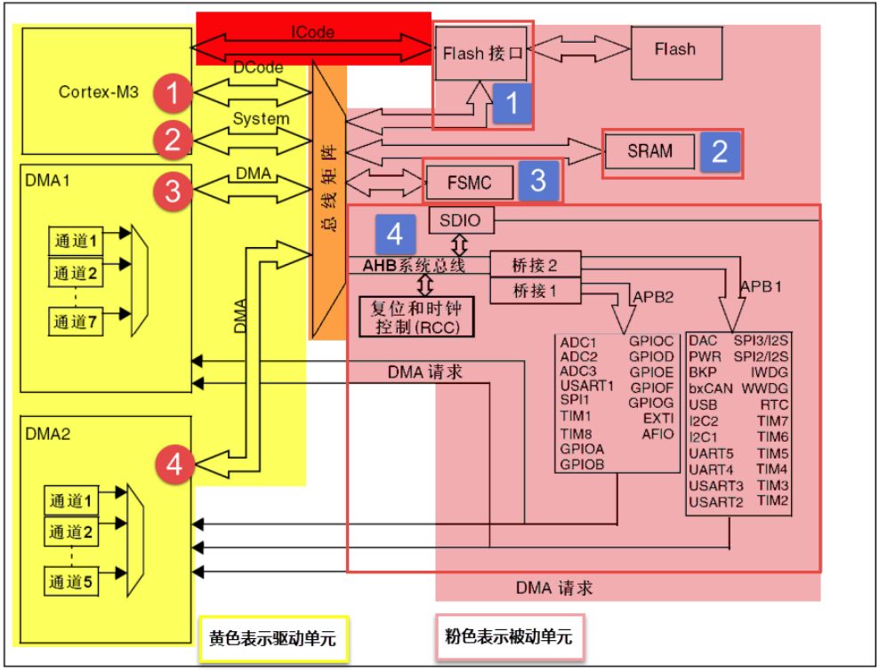

### 2. 存储器映射
存储器本身没有地址，给存储器分配地址的过程叫存储器映射

在图 STM32F10xx 系统框图 中，被控单元的 FLASH，RAM，FSMC 和 AHB 到 APB 的桥（即片上外设），这些功能部件共同排列在一个 4GB 的地址空间内。我们在编程的时候，可以通过他们的地址找到他们，然后来操作他们（通过 C 语言对它们进行数据的读和写）。

#### 存储器区域功能划分
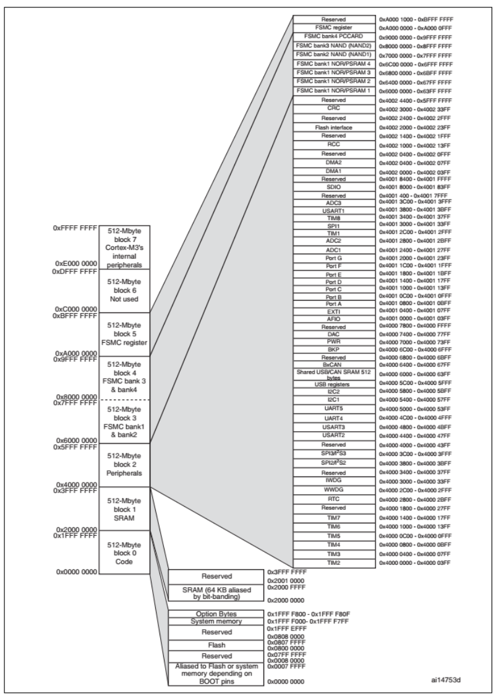
在这 4GB 的地址空间中，ARM 已经粗线条的平均分成了 8 个块，每块 512MB，每个块也都规定了用途，具体分类见表格存储器功能分类。每个块的大小都有 512MB，显然这是非常大的，芯片厂商在每个块的范围内设计各具特色的外设时并不一定都用得完，都是只用了其中的一部分而
已。
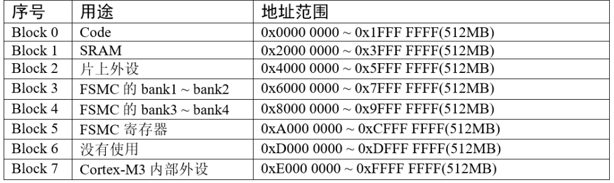

### 3. 寄存器映射
在存储器 Block2 这块区域，设计的是片上外设，它们以四个字节为一个单元，共 32bit，每一个单元对应不同的功能，当我们控制这些单元时就可以驱动外设工作。我们可以找到每个单元的起始地址，然后通过 C 语言指针的操作方式来访问这些单元，如果每次都是通过这种地址的方式来访问，不仅不好记忆还容易出错，这时我们可以**根据每个单元功能的不同，以功能为名给这个内存单元取一个别名，这个别名就是我们经常说的寄存器**，这个给已经分配好地址的有特定功能的内存单元取别名的过程就叫**寄存器映射**。

#### STM32 的外设地址映射
片上外设区分为三条总线，根据外设速度的不同，不同总线挂载着不同的外设，APB1 挂载低速外设，APB2 和 AHB 挂载高速外设。相应总线的最低地址我们称为该总线的基地址，总线基地址也是挂载在该总线上的首个外设的地址。其中 APB1 总线的地址最低，片上外设从这里开始，也叫外设基地址。

#### 外设基地址
总线上挂载着各种外设，这些外设也有自己的地址范围，特定外设的首个地址称为“XX 外设基地址”，也叫 XX 外设的边界地址。具体有关 STM32F10xx 外设的边界地址请参考《STM32F10xx参考手册》的 2.3 小节的存储器映射的表 1：STM32F10xx 寄存器边界地址。

#### 外设寄存器
在 XX 外设的地址范围内，分布着的就是该外设的寄存器。以 GPIO 外设为例，GPIO 是通用输入输出端口的简称，简单来说就是 STM32 可控制的引脚，基本功能是控制引脚输出高电平或者低电平。最简单的应用就是把 GPIO 的引脚连接到 LED 灯的阴极，LED 灯的阳极接电源，然后通过 STM32 控制该引脚的电平，从而实现控制 LED 灯的亮灭。
GPIO 有很多个寄存器，每一个都有特定的功能。每个寄存器为 32bit，占四个字节，在该外设的基地址上按照顺序排列，寄存器的位置都以相对该外设基地址的偏移地址来描述。

有关外设的寄存器说明可参考《STM32F10xx 参考手册》中具体章节的寄存器描述部分，在编程的时候我们需要反复的查阅外设的寄存器说明。

#### 如何理解寄存器的说明
这里我们以“GPIO 端口置位/复位寄存器”为例，教大家如何理解寄存器的说明，具体见图 GPIO端口置位 _ 复位寄存器说明。

[^_^]:(① ② ③ ④ ⑤ ⑥ ⑦ ⑧ ⑨ ⑩ )

* ①  名称
寄存器说明中首先列出了该寄存器中的名称，“(GPIOx_BSRR)(x=A…E)”这段的意思是该寄存器名为“GPIOx_BSRR”其中的“x”可以为 A-E，也就是说这个寄存器说明适用于 GPIOA、GPIOB 至 GPIOE，这些 GPIO 端口都有这样的一个寄存器。
 

* ② 偏移地址
偏移地址是指本寄存器相对于这个外设的基地址的偏移。本寄存器的偏移地址是0x10，从参考手册中我们可以查到 GPIOA 外设的基地址为 0x4001 0800 ，我们就可以算出 GPIOA 的这个 GPIOA_BSRR 寄存器的地址为：0x4001 0800+0x10；同理，由于 GPIOB 的外设基地址为 0x4001 0C00，可算出 GPIOB_BSRR 寄存器的地址为：0x4001 0C00+0x10。其他 GPIO 端口以此类推即可。
 

* ③ 寄存器位表
紧接着的是本寄存器的位表，表中列出它的 0-31 位的名称及权限。表上方的数字为位编号，中间为位名称，最下方为读写权限，其中 w 表示只写，r 表示只读，rw 表示可读写。本寄存器中的位权限都是 w，所以只能写，如果读本寄存器，是无法保证读取到它真正内容的。而有的寄存器位只读，一般是用于表示 STM32外设的某种工作状态的，由 STM32 **硬件自动更改**，程序通过读取那些寄存器位来判断外设的工作状态。
 

* ④ 位功能说明
位功能是寄存器说明中最重要的部分，它详细介绍了寄存器每一个位的功能。例如本寄存器中有两种寄存器位，分别为 BRy 及 BSy，其中的 y 数值可以是 0-15，这里的 0-15 表示端口的引脚号，如 BR0、BS0 用于控制 GPIOx 的第 0 个**引脚**，若x 表示 GPIOA，那就是控制 GPIOA 的第 0 引脚，而 BR1、BS1 就是控制 GPIOA第 1 个引脚。
其中 BRy 引脚的说明是“0：不会对相应的 ODRx 位执行任何操作；1：对相应ODRx 位进行复位”。这里的“复位”是将该位设置为 0 的意思，而“置位”表示将该位设置为 1；说明中的 ODRx 是另一个寄存器的寄存器位，我们只需要知道ODRx 位为 1 的时候，对应的引脚 x 输出高电平，为 0 的时候对应的引脚输出低电平即可 (感兴趣的读者可以查询该寄存器 GPIOx_ODR 的说明了解)。所以，如果对 BR0 写入“1”的话，那么 GPIOx 的第 0 个引脚就会输出“低电平”，但是对 BR0 写入“0”的话，却不会影响 ODR0 位，所以引脚电平不会改变。要想该引脚输出“高电平”，就需要对“BS0”位写入“1”，寄存器位 BSy 与 BRy 是相反的操作。

---
## *附录
> (也不算吧，只是记录一些放在正文有点突兀，但感觉也有价值记录的东西)

* [详细介绍GPIO、I2C、SPI通讯原理以及物理层原理](https://blog.csdn.net/bjbz_cxy/article/details/119925257)

---