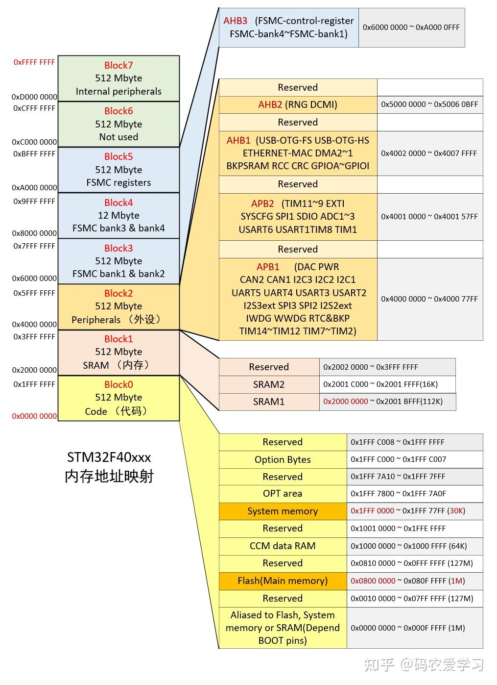
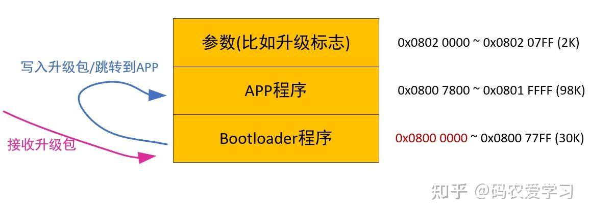
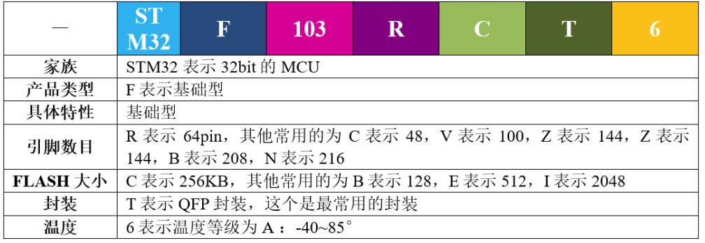
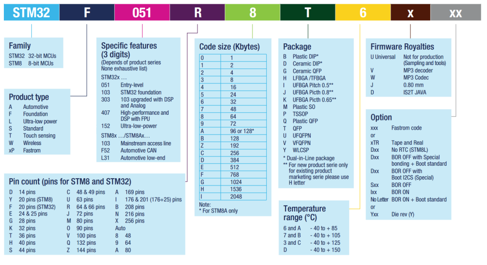
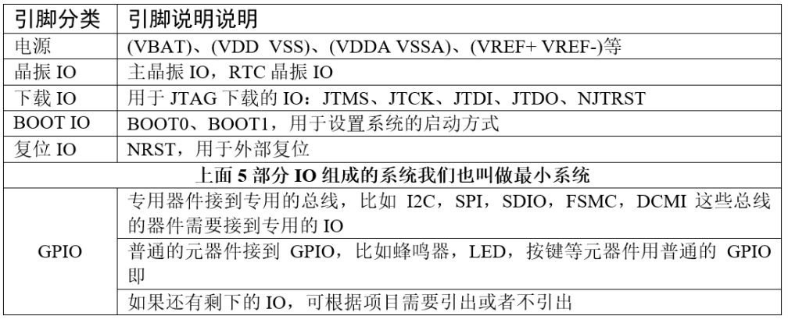
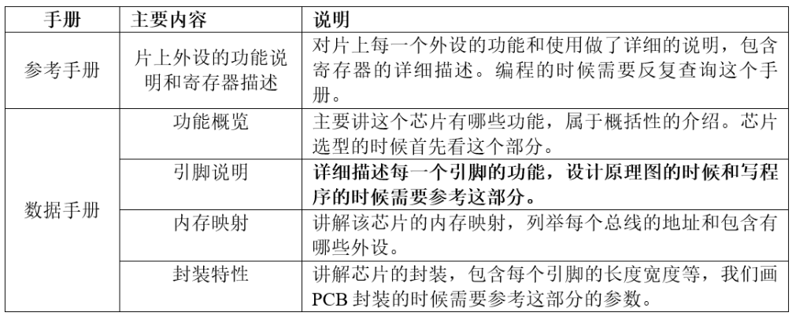
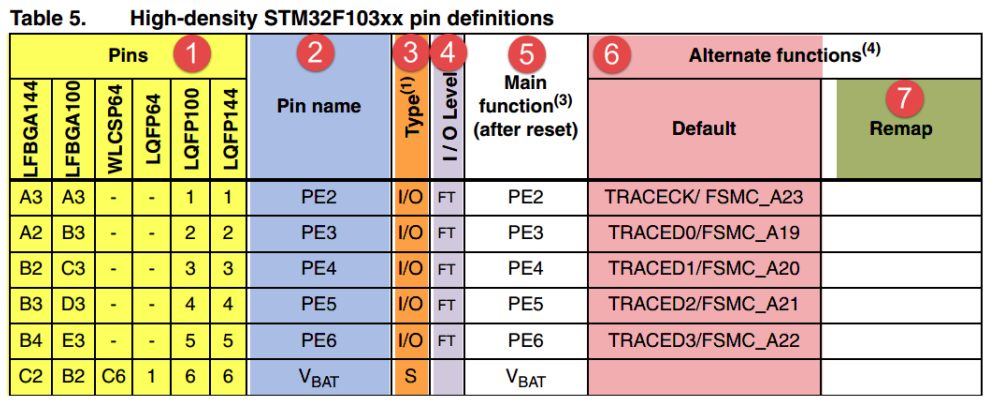
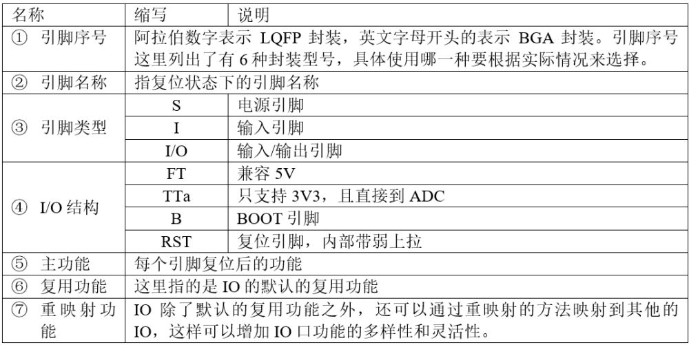
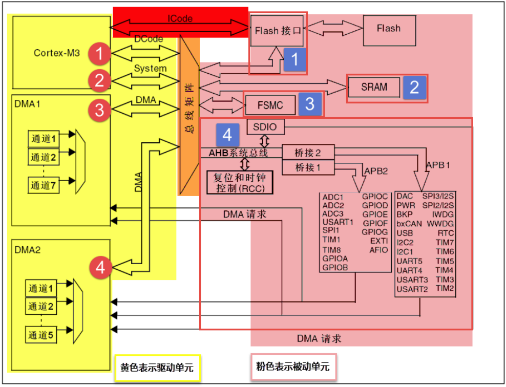

# 文档：MCU学习经历 --时时更新
---
整理:  Keruone Klumsnow
学习设备: 野火STM32F103mini 
芯片型号: STM32F103RCT6

> 学习对象：[野火EmbedFire]《STM32库开发实战指南——基于野火MINI开发板》—20240202
> 参考：https://doc.embedfire.com/products/link/zh/latest/index.html
>> 本文的东西都只是复制黏贴罢了
> 
---
[toc]

---
## 一、单片机烧录方式
> 参考https://zhuanlan.zhihu.com/p/367821312
> 觉得作者(码农爱学习)讲的非常好，就 copy 下来了:smiley:
### 1. 烧录方式简单分类
* ISP (In-System Programming)
* ICP (In-circuit programmer)
* IAP (In-Application Programming)
### 2. 单片机Flash在地址映射表中位置
下图是一张STM32F4xx的地址映射表，从0x0000 0000到0xFFFF FFFF，总计4Gbyte。单片机的片上Flash、片上RAM、片上外设以及外部扩展接口的访问地址，都被映射到这4Gbyte的范围之内。

&emsp;这张图中，我们需要先注意下半部分
* **Main memory 主存储区**
通常，我们编写的代码，是放到主存储区的起始位置（0x0800 0000）开始运行的，烧录程序时，直接将程序烧录到这里即可（KEIL软件给STM32烧录程序的默认烧写地址就是0x0800 0000开始）
* **System memory 系统存储区**
System memory（起始位置0x1FFF 000）是STM32在出厂时，由ST在这个区域内部预置了一段BootLoader， 也就是我们常说的ISP程序 ，这是一块ROM，出厂后无法修改。

了解了程序的具体地址，还要看一下单片机的启动方式：
### 3. 启动方式选择
STM32有两个BOOT引脚，通过配置不同的高低电平，可以让单片机从不同的地址开始运行。
| boot0 | boot1 | 描述 |启动区域|对应烧录方式|
|:------:|:-----:|:-----|:------:|:--:|
|0|任意|通常我们是在Main memory **主存储区（0x0800 0000）运行程序**，BOOT0引脚拉低即可。 这种情况，KEIL软件给STM32烧录程序，就是**直接在这个地址烧录**，烧录完，**直接在这个地址处运行**。|主闪存存储器|ICP|
|1|0|这种情况就用在使用串口方式给STM32烧录程序，这时单片机从**系统存储器（0x1FFF 0000）启动**，运行的是**出厂预置的BootLoader程序**，可以**接收串口发来的程序**，并将其**写入Main memory（0x0800 0000**），程序烧录完成后，再将BOOT0引脚拉低，Main memory（0x0800 0000）处运行刚烧录的代码了。|系统存储器|ISP|
|1|1|这种情况是从内存中启动，**内置SRAM（也就是STM32的内存中）**，既然是SRAM，自然也就没有程序存储的能力了，这个模式一般用于程序调试。|内置SRAM|IAP|

### 4. 补充IAP
> 因为前两个较为好理解，就不多赘述了

IAP的原理与上面两种有较大区别，这种方式**将主存储区又分成了两个区域**（根据实际需要由开发者自行分配），<u>0800 0000起始处的这部分，存储一个开发者自己设计的Bootloader程序，另一部分存储真正需要运行的APP程序</u>。

单片机的Bootloader程序，其主要作用就是给单片机升级。在单片机启动时，首先从Bootloader程序启动，一般情况不需要升级，就会立即从Bootloader程序跳转到存储区另一部分的APP程序开始运行。

假如Bootloader程序时，需要进行升级（比如APP程序运行时，接收到升级指令，可以在flash中的特定位置设置一个标志，然后触发重启，重启后进入Bootloader程序，Bootloader程序根据标志位就能判断是否需要升级），则会通过某种方式（比如通过WIFI接收升级包，或借助另一块单片机接收升级包，Bootloader再通过串口或SPI等方式从另一块单片机获取升级包数据）先将接收到的程序写入存储区中存储APP程序的那个位置，写入完成后再跳转到该位置，即实现了程序的升级

---
## 二、 了解STM32

STM32，从字面上来理解，ST 是意法半导体，M 是 Microelectronics 的缩写，32 表示 32 位，合起
来理解，STM32 就是指 ST 公司开发的 32 位微控制器。在如今的 32 位控制器当中，STM32 可以
说是最璀璨的新星，它受宠若娇，大受工程师和市场的青睐，无芯能出其右。

### 1. STM32F103RCT6 各字符含义

### 2. 如何分配原理图IO

### 3. IO参考资料来源
要想根据功能来分配 IO，那就得先知道每个 IO 的功能说明，这个我们可以从官方的数据手册里面找到。在学习的时候，有两个官方资料我们会经常用到，一个是参考手册（英文叫 Referencemanual），另外一个是数据手册（英文叫 Data Sheet）。两者的具体区别见表格参考手册和数据手册的内容区别。

一句话概括：**数据手册**主要用于**芯片选型和设计原理图**时参考，**参考手册**主要用于在**编程**的时候查阅。官方的这两个文档可以从官方网址里面下载：https://www.stmcu.com.cn/Product/pro_detail/STM32F1/product.

---
## 三、 寄存器学习
### 1. 芯片简析
我们看到的 STM32 芯片是已经封装好的成品，主要由内核和片上外设组成。若与电脑类比，内核与外设就如同电脑上的 CPU 与主板、内存、显卡、硬盘的关系。
STM32F103 采用的是 Cortex-M3 内核，内核即 CPU，由 ARM 公司设计。ARM 公司并不生产芯片，而是出售其芯片技术授权。芯片生产厂商 (SOC) 如 ST、TI、 Freescale，负责在内核之外设计部件并生产整个芯片，这些内核之外的部件被称为核外外设或片上外设。如 GPIO、USART（串口）、I2C、SPI 等都叫做片上外设。具体见图 *STM32 芯片架构简图*。

芯片（*这里指**内核***，或者叫 CPU）和外设之间通过各种总线连接，其中驱动单元有 4 个，被动单元也有 4 个，具体见图 STM32F10xx 系统框图。为了方便理解，我们都可以把**驱动单元理解成是CPU 部分**，**被动单元都理解成外设**。下面我们简单介绍下驱动单元和被动单元的各个部件。

#### 驱动单元
* **ICode总线**：ICode 中的 I 表示 Instruction，即指令。我们写好的程序编译之后都是一条条指令，存放在 FLASH中，内核要读取这些指令来执行程序就必须通过 ICode 总线，它几乎每时每刻都需要被使用，它是专门用来取指的。
 

* **DCode 总线**
DCode 中的 D 表示 Data，即数据，那说明这条总线是用来取数的。我们在写程序的时候，数据有常量和变量两种，<u>**常量**就是固定不变的，用 C 语言中的 const 关键字修饰，是放到**内部的 FLASH**当中的</u>，<u>**变量**是可变的，不管是全局变量还是局部变量都放在**内部的 SRAM**</u>。因为数据可以被Dcode 总线和 DMA 总线访问，所以为了避免访问冲突，在取数的时候需要经过一个总线矩阵来仲裁，决定哪个总线在取数。
 

* **系统总线**
系统总线主要是访问**外设的寄存器**，我们通常说的寄存器编程，即读写寄存器都是通过这根系统总线来完成的。
 

* **DMA 总线**
DMA 总线也主要是用来传输数据，这个数据可以是在某个外设的数据寄存器，可以在 SRAM，可以在内部的 FLASH。因为数据可以被 Dcode 总线和 DMA 总线访问，所以为了避免访问冲突，在取数的时候需要经过一个总线矩阵来仲裁，决定哪个总线在取数。
> DMA传输将数据从一个地址空间复制到另一个地址空间，提供在外设和存储器之间或者存储器和存储器之间的高速数据传输。当CPU初始化这个传输动作，传输动作本身是由DMA控制器来实现和完成的。DMA传输方式无需CPU直接控制传输，也没有中断处理方式那样保留现场和恢复现场过程，通过硬件为RAM和IO设备开辟一条直接传输数据的通道，使得CPU的效率大大提高。
> 参考：[dma总线全称_DMA原理介绍](https://blog.csdn.net/weixin_30222083/article/details/111954489#:~:text=DMA%EF%BC%8C%E5%85%A8%E7%A7%B0Direct%20Memory,Access%EF%BC%8C%E5%8D%B3%E7%9B%B4%E6%8E%A5%E5%AD%98%E5%82%A8%E5%99%A8%E8%AE%BF%E9%97%AE%E3%80%82%20DMA%E4%BC%A0%E8%BE%93%E5%B0%86%E6%95%B0%E6%8D%AE%E4%BB%8E%E4%B8%80%E4%B8%AA%E5%9C%B0%E5%9D%80%E7%A9%BA%E9%97%B4%E5%A4%8D%E5%88%B6%E5%88%B0%E5%8F%A6%E4%B8%80%E4%B8%AA%E5%9C%B0%E5%9D%80%E7%A9%BA%E9%97%B4%EF%BC%8C%E6%8F%90%E4%BE%9B%E5%9C%A8%E5%A4%96%E8%AE%BE%E5%92%8C%E5%AD%98%E5%82%A8%E5%99%A8%E4%B9%8B%E9%97%B4%E6%88%96%E8%80%85%E5%AD%98%E5%82%A8%E5%99%A8%E5%92%8C%E5%AD%98%E5%82%A8%E5%99%A8%E4%B9%8B%E9%97%B4%E7%9A%84%E9%AB%98%E9%80%9F%E6%95%B0%E6%8D%AE%E4%BC%A0%E8%BE%93%E3%80%82%20%E5%BD%93CPU%E5%88%9D%E5%A7%8B%E5%8C%96%E8%BF%99%E4%B8%AA%E4%BC%A0%E8%BE%93%E5%8A%A8%E4%BD%9C%EF%BC%8C%E4%BC%A0%E8%BE%93%E5%8A%A8%E4%BD%9C%E6%9C%AC%E8%BA%AB%E6%98%AF%E7%94%B1DMA%E6%8E%A7%E5%88%B6%E5%99%A8%E6%9D%A5%E5%AE%9E%E7%8E%B0%E5%92%8C%E5%AE%8C%E6%88%90%E7%9A%84%E3%80%82)

#### 被动单元
* **内部的闪存存储器**
内部的闪存存储器即 FLASH，我们编写好的程序就放在这个地方。内核通过 ICode 总线来取里面的指令。
 

* **内部的 SRAM**
内部的 SRAM，即我们通常说的 RAM，程序的变量，堆栈等的开销都是基于内部的 SRAM。内核通过 DCode 总线来访问它。
 

* **FSMC**
FSMC 的英文全称是 Flexible static memory controller，叫灵活的静态的存储器控制器，是STM32F10xx 中一个很有特色的外设，通过 FSMC，我们可以扩展内存，如外部的 SRAM，NAND-FLASH 和 NORFLASH。但有一点我们要注意的是，FSMC 只能扩展静态的内存，即名称里面的S：static，不能是动态的内存，比如 SDRAM 就不能扩展。
 

* **AHB 到 APB 的桥**
从 AHB 总线延伸出来的两条 APB2 和 APB1 总线，上面挂载着 STM32 各种各样的特色外设。我们经常说的 GPIO、串口、I2C、SPI 这些外设就挂载在这两条总线上，这个是我们学习 STM32 的重点，就是要学会编程这些外设去驱动外部的各种设备。
> AHB(Advanced High-performance Bus), 高速总线，用来接高速外设的。APB (Advanced Peripheral Bus) 低速总线，用来接低速外设的。高速的接在AHB上，低速的接在APB上。中间有一个AHB2APB的桥。你可以理解这个桥也是一个告诉的AHB Slave *（个人理解：外设）*。
> 参考：[AHB与APB总线你需要知道的事儿](https://zhuanlan.zhihu.com/p/157808097)

---
## *附录
> (也不算吧，只是记录一些放在正文有点突兀，但感觉也有价值记录的东西)

---